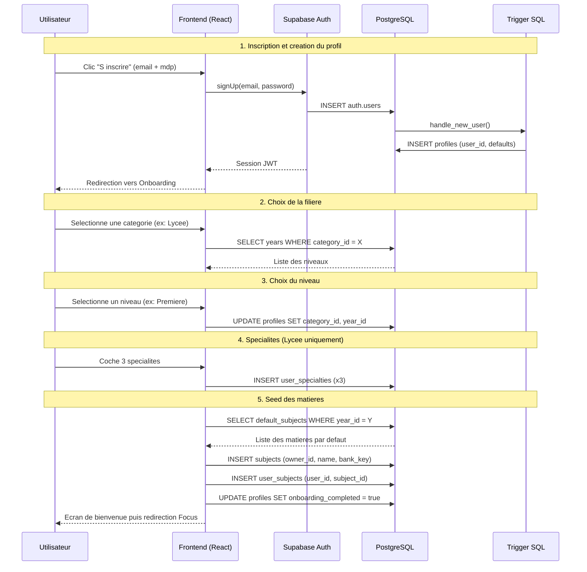
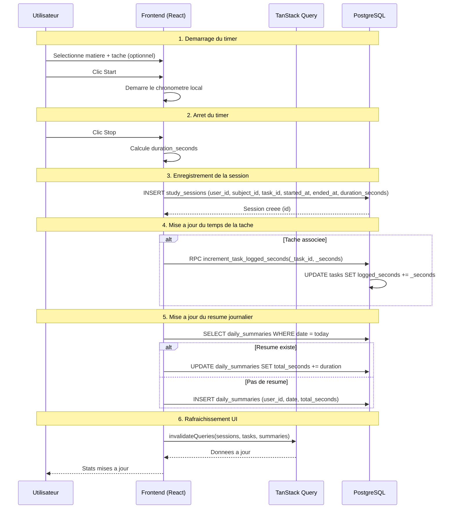

# StudyTracker — Documentation Technique Complète

> Document fusionné — Mis à jour le 5 avril 2026

---

# Partie 0 — Architecture Logicielle (Stack Technique)

## Vue d'ensemble

StudyTracker est une **Single Page Application (SPA)** client-side qui s'appuie sur **Supabase** (via Lovable Cloud) comme Backend-as-a-Service. Il n'y a pas de serveur backend custom — la persistance, l'authentification et les fonctions serverless sont entièrement gérées par Supabase.

## Schéma d'architecture

```
┌─────────────────────────────────────────────────────┐
│                    FRONTEND (SPA)                    │
│  React 18 · TypeScript 5 · Vite 5 (SWC)            │
│                                                     │
│  UI        : Shadcn/UI (Radix) + Tailwind CSS v3   │
│  State     : TanStack Query v5 + React Context      │
│  Routing   : React Router v6                        │
│  i18n      : i18next (FR / EN)                      │
│  Animations: Framer Motion                          │
│  Charts    : Recharts                               │
│  Forms     : React Hook Form + Zod                  │
│  Theme     : next-themes (dark / light)             │
└─────────────────────┬───────────────────────────────┘
                      │ HTTPS (REST + Realtime WebSocket)
┌─────────────────────▼───────────────────────────────┐
│              SUPABASE (Lovable Cloud)                │
│                                                     │
│  Auth       : Email, Google OAuth, Apple OAuth (JWT)│
│  PostgreSQL : 14 tables + 1 vue, RLS sur chaque     │
│  Storage    : Bucket avatars                        │
│  Edge Funcs : Serverless Deno                       │
│  Realtime   : WebSocket (groupes d'étude)           │
└─────────────────────────────────────────────────────┘
```

## Détail du Frontend

| Composant | Technologie | Rôle |
|-----------|-------------|------|
| Framework | React 18 + TypeScript 5 | Rendu UI, typage statique |
| Bundler | Vite 5 (SWC) | Build rapide, HMR |
| Routing | React Router v6 | Navigation SPA, routes protégées |
| État serveur | TanStack Query v5 | Cache, synchronisation, invalidation |
| État local | React Context (AuthContext) | Session, thème, langue |
| Composants UI | Shadcn/UI (Radix UI) | 40+ composants accessibles |
| Styling | Tailwind CSS v3 + tokens HSL | Design system dark/light |
| Animations | Framer Motion | Transitions, micro-interactions |
| Formulaires | React Hook Form + Zod | Validation typée |
| i18n | i18next + react-i18next | Français / Anglais |
| Graphiques | Recharts | Stats d'étude |
| Thème | next-themes | Bascule dark/light |

## Détail du Backend (Supabase via Lovable Cloud)

| Service | Usage |
|---------|-------|
| **Auth** | Inscription email, Google OAuth, Apple OAuth. Sessions JWT auto-refresh. |
| **PostgreSQL** | 14 tables + 1 vue. RLS activé partout. Fonctions `SECURITY DEFINER` pour checks cross-table. |
| **Storage** | Bucket `avatars` pour les photos de profil. |
| **Edge Functions** | Fonctions serverless Deno pour logique côté serveur. |
| **Realtime** | WebSocket disponible (ex: groupes d'étude). |

## Sécurité

- **RLS** activé sur chaque table — un utilisateur ne voit que ses données.
- **Fonctions SECURITY DEFINER** : `is_group_member()`, `is_group_admin()` pour les vérifications sans récursion RLS.
- **JWT** géré par Supabase Auth, rafraîchissement automatique côté client.
- Seule la clé `anon` (publique) est utilisée dans le code frontend.

## Arborescence du projet

```
src/
├── components/          # Composants React réutilisables
│   └── ui/              # Shadcn/UI (40+ composants)
├── contexts/            # AuthContext (session, thème, langue)
├── hooks/               # Hooks custom (use-mobile, use-toast)
├── i18n/                # Traductions FR / EN
├── integrations/
│   └── supabase/        # Client auto-généré + types DB
├── lib/                 # Utilitaires
├── pages/               # Focus, Tasks, Goals, Stats, Groups, Profile, Onboarding, Auth
├── App.tsx              # Routes & providers
└── main.tsx             # Point d'entrée
```

---

# Partie 1 — Schéma Base de Données

## Vue d'ensemble

StudyTracker est une application de suivi d'études. La base de données est structurée autour de plusieurs domaines fonctionnels :

1. **Référentiel académique** (categories, years, default_subjects, specialties)
2. **Profils utilisateurs** (profiles, user_specialties, user_subjects)
3. **Matières & Activité** (subjects, tasks, study_sessions, daily_summaries)
4. **Objectifs** (subject_day_goals)
5. **Groupes** (groups, group_members)

## Diagramme des relations

```
auth.users (Supabase)
    │
    ├──► profiles (1:1)
    │       ├── category_id ──► categories
    │       └── year_id ──► years
    │
    ├──► user_specialties (1:N)
    │       └── specialty_id ──► specialties
    │
    ├──► subjects (1:N, owner_id)
    │       └── parent_subject_id ──► subjects (auto-référence)
    │
    ├──► user_subjects (1:N)
    │       └── subject_id ──► subjects
    │
    ├──► tasks (1:N)
    │       └── subject_id ──► subjects
    │
    ├──► study_sessions (1:N)
    │       ├── subject_id ──► subjects
    │       └── task_id ──► tasks
    │
    ├──► daily_summaries (1:N)
    │
    ├──► subject_day_goals (1:N)
    │       └── subject_id ──► subjects
    │
    └──► groups (1:N, owner_id)
            └── group_members (N:M)
```

## Tables détaillées

### 1. `categories`
Filières d'études (Primaire, Collège, Lycée, CPGE, Médecine, etc.)

| Colonne | Type | Nullable | Défaut | Description |
|---------|------|----------|--------|-------------|
| `id` | integer | Non | Auto-incrémenté | Clé primaire |
| `name` | text | Non | — | Nom de la catégorie |

### 2. `years`
Niveaux d'études filtrés par catégorie.

| Colonne | Type | Nullable | Défaut | Description |
|---------|------|----------|--------|-------------|
| `id` | integer | Non | Auto-incrémenté | Clé primaire |
| `category_id` | integer | Non | — | FK → categories |
| `name` | text | Non | — | Nom du niveau |
| `display_order` | integer | Non | 0 | Ordre d'affichage |

### 3. `default_subjects`
Matières par défaut pré-configurées pour chaque niveau.

| Colonne | Type | Nullable | Défaut | Description |
|---------|------|----------|--------|-------------|
| `id` | integer | Non | Auto-incrémenté | Clé primaire |
| `year_id` | integer | Non | — | FK → years |
| `name` | text | Non | — | Nom de la matière |
| `display_order` | integer | Non | 0 | Ordre d'affichage |

### 4. `specialties`
Spécialités du Lycée général (19 spécialités).

| Colonne | Type | Nullable | Défaut | Description |
|---------|------|----------|--------|-------------|
| `id` | integer | Non | Auto-incrémenté | Clé primaire |
| `name` | text | Non | — | Nom de la spécialité |
| `available_in_premiere` | boolean | Non | false | Disponible en Première |
| `available_in_terminale` | boolean | Non | false | Disponible en Terminale |

### 5. `profiles`
Profil utilisateur (1:1 avec auth.users). Créé automatiquement via trigger.

| Colonne | Type | Nullable | Défaut | Description |
|---------|------|----------|--------|-------------|
| `id` | uuid | Non | gen_random_uuid() | Clé primaire |
| `user_id` | uuid | Non | — | Réf. auth.users |
| `username` | text | Non | '' | Nom d'utilisateur |
| `avatar_url` | text | Oui | null | URL avatar |
| `xp_total` | integer | Non | 0 | XP accumulé |
| `level` | integer | Non | 1 | Niveau actuel |
| `current_streak` | integer | Non | 0 | Streak en cours (jours) |
| `longest_streak` | integer | Non | 0 | Meilleur streak |
| `weekly_goal_minutes` | integer | Non | 600 | Objectif hebdo (min) |
| `language_preference` | text | Non | 'en' | Langue (en/fr) |
| `theme_preference` | text | Non | 'light' | Thème (light/dark) |
| `onboarding_completed` | boolean | Non | false | Onboarding terminé |
| `category_id` | integer | Oui | null | FK → categories |
| `year_id` | integer | Oui | null | FK → years |
| `custom_label` | text | Oui | null | Label perso (catégorie "Autre") |
| `created_at` | timestamptz | Non | now() | Date de création |
| `updated_at` | timestamptz | Non | now() | Dernière MàJ |

### 6. `user_specialties`
Spécialités choisies par l'utilisateur (Lycée uniquement).

| Colonne | Type | Nullable | Défaut | Description |
|---------|------|----------|--------|-------------|
| `id` | uuid | Non | gen_random_uuid() | Clé primaire |
| `user_id` | uuid | Non | — | Réf. auth.users |
| `specialty_id` | integer | Non | — | FK → specialties |
| `display_order` | integer | Non | 0 | Ordre d'affichage |

### 7. `subjects`
Matières de l'utilisateur. Supporte la hiérarchie et le soft-delete.

| Colonne | Type | Nullable | Défaut | Description |
|---------|------|----------|--------|-------------|
| `id` | uuid | Non | gen_random_uuid() | Clé primaire |
| `name` | text | Non | — | Nom de la matière |
| `owner_id` | uuid | Non | — | Réf. auth.users |
| `color` | text | Non | 'blue' | Couleur |
| `is_active` | boolean | Non | true | Active/inactive |
| `deleted_at` | timestamptz | Oui | null | Suppression douce |
| `bank_key` | text | Oui | null | Clé banque de matières |
| `icon` | text | Oui | null | Icône optionnelle |
| `parent_subject_id` | uuid | Oui | null | FK → subjects |
| `created_at` | timestamptz | Non | now() | Date de création |

**Règles métier** : `is_active = false` → masquée des sélecteurs mais conservée pour les stats. Suppression uniquement si aucune session/tâche liée.

### 8. `user_subjects`
Liaison utilisateur ↔ matière avec personnalisation.

| Colonne | Type | Nullable | Défaut | Description |
|---------|------|----------|--------|-------------|
| `id` | uuid | Non | gen_random_uuid() | Clé primaire |
| `user_id` | uuid | Non | — | Réf. auth.users |
| `subject_id` | uuid | Non | — | FK → subjects |
| `display_order` | integer | Non | 0 | Ordre d'affichage |
| `is_hidden` | boolean | Non | false | Masquée |
| `custom_color` | text | Oui | null | Couleur personnalisée |

### 9. `tasks`

| Colonne | Type | Nullable | Défaut | Description |
|---------|------|----------|--------|-------------|
| `id` | uuid | Non | gen_random_uuid() | Clé primaire |
| `user_id` | uuid | Non | — | Réf. auth.users |
| `title` | text | Non | — | Titre de la tâche |
| `subject_id` | uuid | Oui | null | FK → subjects |
| `status` | text | Non | 'planned' | planned/in_progress/done |
| `planned_minutes` | integer | Oui | null | Durée prévue (min) |
| `logged_seconds` | integer | Non | 0 | Temps passé (sec) |
| `scheduled_for` | date | Oui | null | Date planifiée |
| `created_at` | timestamptz | Non | now() | Date de création |
| `updated_at` | timestamptz | Non | now() | Dernière MàJ |

### 10. `study_sessions`

| Colonne | Type | Nullable | Défaut | Description |
|---------|------|----------|--------|-------------|
| `id` | uuid | Non | gen_random_uuid() | Clé primaire |
| `user_id` | uuid | Non | — | Réf. auth.users |
| `subject_id` | uuid | Oui | null | FK → subjects |
| `task_id` | uuid | Oui | null | FK → tasks |
| `started_at` | timestamptz | Non | now() | Début |
| `ended_at` | timestamptz | Oui | null | Fin |
| `duration_seconds` | integer | Non | 0 | Durée (sec) |
| `notes` | text | Oui | null | Notes |
| `created_at` | timestamptz | Non | now() | Date de création |

### 11. `daily_summaries`

| Colonne | Type | Nullable | Défaut | Description |
|---------|------|----------|--------|-------------|
| `id` | uuid | Non | gen_random_uuid() | Clé primaire |
| `user_id` | uuid | Non | — | Réf. auth.users |
| `date` | date | Non | — | Jour |
| `total_seconds` | integer | Non | 0 | Temps total (sec) |
| `streak_count` | integer | Non | 0 | Streak |

### 12. `subject_day_goals`

| Colonne | Type | Nullable | Défaut | Description |
|---------|------|----------|--------|-------------|
| `id` | uuid | Non | gen_random_uuid() | Clé primaire |
| `user_id` | uuid | Non | — | Réf. auth.users |
| `subject_id` | uuid | Non | — | FK → subjects |
| `day_of_week` | smallint | Non | — | 0=Dim … 6=Sam |
| `minutes` | integer | Non | 60 | Objectif (min) |
| `created_at` | timestamptz | Non | now() | Date de création |
| `updated_at` | timestamptz | Non | now() | Dernière MàJ |

### 13. `groups`

| Colonne | Type | Nullable | Défaut | Description |
|---------|------|----------|--------|-------------|
| `id` | uuid | Non | gen_random_uuid() | Clé primaire |
| `name` | text | Non | — | Nom du groupe |
| `description` | text | Non | '' | Description |
| `owner_id` | uuid | Non | — | Réf. auth.users |
| `visibility` | text | Non | 'public' | public/private |
| `invite_code` | text | Non | Auto-généré | Code d'invitation |
| `requires_admin_approval` | boolean | Non | false | Approbation requise |
| `join_password` | text | Oui | null | Mot de passe |
| `created_at` | timestamptz | Non | now() | Date de création |

### 14. `group_members`

| Colonne | Type | Nullable | Défaut | Description |
|---------|------|----------|--------|-------------|
| `id` | uuid | Non | gen_random_uuid() | Clé primaire |
| `group_id` | uuid | Non | — | FK → groups |
| `user_id` | uuid | Non | — | Réf. auth.users |
| `role` | text | Non | 'member' | admin/member |
| `status` | text | Non | 'pending' | pending/approved |
| `joined_at` | timestamptz | Non | now() | Date d'adhésion |

### Vue `groups_public`
Vue sécurisée exposant les infos publiques des groupes avec `member_count`.

## Triggers & Fonctions

| Élément | Description |
|---------|-------------|
| `handle_new_user` | Crée automatiquement un profil à l'inscription |
| `update_updated_at_column` | Met à jour `updated_at` sur profiles, tasks, subject_day_goals |
| `is_group_member()` | Vérifie l'appartenance à un groupe |
| `is_group_admin()` | Vérifie le rôle admin |
| `increment_task_logged_seconds()` | Incrémente le temps logué |

## Données seed

| Table | Nombre d'entrées |
|-------|-----------------|
| categories | 11 |
| years | 87 |
| default_subjects | 611 |
| specialties | 19 |

---

# Partie 2 — Matrice d'accès RLS

## Légende

- ✅ = Autorisé
- ❌ = Bloqué
- 🔒 = Conditionnel

## Tables référentielles (lecture seule)

| Table | SELECT | INSERT | UPDATE | DELETE |
|-------|--------|--------|--------|--------|
| `categories` | ✅ tous les auth | ❌ | ❌ | ❌ |
| `years` | ✅ tous les auth | ❌ | ❌ | ❌ |
| `default_subjects` | ✅ tous les auth | ❌ | ❌ | ❌ |
| `specialties` | ✅ tous les auth | ❌ | ❌ | ❌ |

## Tables utilisateur (accès propre)

| Table | SELECT | INSERT | UPDATE | DELETE |
|-------|--------|--------|--------|--------|
| `profiles` | ✅ tous les auth | ✅ own | ✅ own | ✅ own |
| `subjects` | ✅ own | ✅ own | ✅ own | ✅ own |
| `user_subjects` | ✅ own | ✅ own | ✅ own | ✅ own |
| `user_specialties` | ✅ own | ✅ own | ✅ own | ✅ own |
| `tasks` | ✅ own | ✅ own | ✅ own | ✅ own |
| `study_sessions` | ✅ own | ✅ own | ✅ own | ✅ own |
| `daily_summaries` | ✅ own | ✅ own | ✅ own | ✅ own |
| `subject_day_goals` | ✅ own | ✅ own | ✅ own | ✅ own |

## Tables groupes (accès conditionnel)

| Table | SELECT | INSERT | UPDATE | DELETE |
|-------|--------|--------|--------|--------|
| `groups` | ❌ (via vue) | ✅ own | 🔒 admin | 🔒 admin |
| `group_members` | 🔒 membre | ✅ own | 🔒 admin | 🔒 soi ou admin |
| `groups_public` (vue) | ✅ tous les auth | — | — | — |

## Détail des conditions 🔒

- **groups UPDATE/DELETE** : `is_group_admin(id)`
- **group_members SELECT** : `is_group_member(group_id)`
- **group_members UPDATE** : `is_group_admin(group_id)`
- **group_members DELETE** : `auth.uid() = user_id OR is_group_admin(group_id)`

---

# Partie 2b — Logique métier : Streaks & XP

## Vue d'ensemble

Les champs `xp_total`, `level`, `current_streak` et `longest_streak` sont stockés dans la table `profiles`. Actuellement, **leur calcul n'est pas encore automatisé** — les valeurs sont initialisées à 0/1 à la création du profil. Cette section documente la logique prévue.

## Calcul de l'XP

| Source d'XP | Règle | Statut |
|-------------|-------|--------|
| Temps d'étude | 1 minute étudiée = **1 XP** | ❌ Non implémenté |
| Tâche complétée | Bonus de **5 XP** par tâche passée en `done` | ❌ Non implémenté |
| Bonus streak | **+2 XP** par jour de streak actif (multiplicateur) | ❌ Non implémenté |

### Calcul du niveau

```
level = floor(xp_total / 100) + 1
```

Chaque palier de 100 XP = 1 niveau. Affiché dans le profil.

### Où implémenter ?

**Option A — Trigger SQL** (recommandé pour la cohérence) :
- Un trigger `AFTER INSERT` sur `study_sessions` calcule `duration_seconds / 60` et incrémente `xp_total` dans `profiles`.
- Un trigger `AFTER UPDATE` sur `tasks` (quand `status` passe à `done`) ajoute le bonus.

**Option B — Edge Function Cron** :
- Un job planifié recalcule l'XP total chaque nuit à partir des sessions.

## Logique des Streaks

### Définition

Un **streak** = nombre de jours consécutifs où l'utilisateur a au moins **1 session d'étude enregistrée** (via `study_sessions` ou `daily_summaries`).

### Quand le streak est-il rompu ?

Le streak est considéré comme **rompu** si **aucune session n'a été enregistrée** pour la date `yesterday` (en UTC) au moment de la vérification.

```
Si daily_summaries.date = DATE(now() - interval '1 day') n'existe PAS
   → current_streak = 0
Sinon
   → current_streak += 1
   → longest_streak = MAX(current_streak, longest_streak)
```

### Implémentation actuelle

| Composant | Statut | Détail |
|-----------|--------|--------|
| Affichage du streak (Profile) | ✅ | Lit `profiles.current_streak` |
| Affichage du streak (Stats) | ⚠️ Partiel | Affiche `–` (placeholder) |
| Incrémentation automatique | ❌ | Pas de logique de calcul |
| Réinitialisation automatique | ❌ | Pas de cron/trigger |

### Implémentation recommandée

**Edge Function Cron** (via `pg_cron` + `pg_net`) exécutée chaque jour à **00:05 UTC** :

```
1. Pour chaque profil avec current_streak > 0 :
   - Vérifier si une entrée daily_summaries existe pour hier
   - Si NON → current_streak = 0
   - Si OUI → current_streak += 1, longest_streak = MAX(...)

2. Pour chaque profil avec une session hier ET current_streak = 0 :
   - current_streak = 1
```

### Tables impliquées

| Table | Rôle dans le calcul |
|-------|---------------------|
| `study_sessions` | Source de vérité (sessions brutes) |
| `daily_summaries` | Résumé journalier pré-agrégé (total_seconds, streak_count) |
| `profiles` | Stockage du streak courant et record |

### Schéma de flux

```
study_sessions (INSERT)
    │
    ▼
daily_summaries (UPSERT par date)
    │
    ▼ (Cron 00:05 UTC)
profiles.current_streak  ← recalculé
profiles.longest_streak  ← MAX(current, longest)
profiles.xp_total        ← recalculé
profiles.level           ← floor(xp/100) + 1
```

---

# Partie 2c — Flux de données critiques (Diagrammes de séquence)

## Flux 1 : Onboarding complet

Inscription → Trigger création profil → Choix filière/niveau → Spécialités (Lycée) → Seed des matières.



**Points clés :**
- Le profil est créé **automatiquement** par le trigger `handle_new_user` dès l'inscription.
- Les matières sont copiées depuis `default_subjects` vers `subjects` (propriété de l'utilisateur) + `user_subjects` (liaison).
- L'étape 4 (spécialités) n'apparaît que pour les niveaux Première et Terminale du Lycée général.

## Flux 2 : Fin de session de travail

Timer stop → INSERT `study_sessions` → UPDATE `tasks.logged_seconds` → UPSERT `daily_summaries`.



**Points clés :**
- Le chronomètre tourne **côté client** — seul le résultat final est envoyé à la DB.
- `increment_task_logged_seconds` est une **fonction SQL** (`SECURITY DEFINER`) qui incrémente atomiquement le compteur.
- Le `daily_summaries` est géré en **UPSERT** côté frontend (SELECT puis INSERT ou UPDATE).
- Après enregistrement, TanStack Query **invalide les caches** pour rafraîchir toutes les vues (Stats, Profile, Tasks).

---

# Partie 3 — Checklist des fonctionnalités

## Onboarding

| Fonctionnalité | Statut |
|---|---|
| Choix de filière (11 catégories) | ✅ |
| Choix du niveau (filtré par filière) | ✅ |
| Sélection spécialités Lycée (3 en Première, 2 en Terminale) | ✅ |
| Confirmation des matières (ajout/suppression) | ✅ |
| Écran de bienvenue récapitulatif | ✅ |
| Redirection auto si onboarding non complété | ✅ |
| Catégorie "Autre" avec label personnalisé | ✅ |

## Profil

| Fonctionnalité | Statut |
|---|---|
| Affichage username / avatar | ✅ |
| Gestion des matières (dropdown + ajout) | ✅ |
| Suggestions de matières similaires | ✅ |
| Matières actives / inactives (toggle) | ✅ |
| Suppression si aucune session/tâche liée | ✅ |
| Choix langue (FR/EN) | ✅ |
| Choix thème (light/dark) | ✅ |
| Objectif hebdomadaire | ✅ |
| Modification filière/niveau depuis le profil | ❌ |

## Focus (Timer)

| Fonctionnalité | Statut |
|---|---|
| Sélection matière / tâche | ✅ |
| Timer (chronomètre) | ✅ |
| Enregistrement session | ✅ |
| Filtrage matières actives | ✅ |

## Tâches

| Fonctionnalité | Statut |
|---|---|
| CRUD tâche avec matière | ✅ |
| Statuts (planned/in_progress/done) | ✅ |
| Durée planifiée + temps logué auto | ✅ |
| Planification par date | ✅ |
| Filtrage matières actives | ✅ |

## Objectifs

| Fonctionnalité | Statut |
|---|---|
| Par matière et par jour (auto-save) | ✅ |
| Persistance en base | ✅ |
| Filtrage matières actives | ✅ |

## Statistiques

| Fonctionnalité | Statut |
|---|---|
| Résumé journalier / streak / XP | ✅ |
| Graphiques (recharts) | ✅ |

## Groupes

| Fonctionnalité | Statut |
|---|---|
| Création + code d'invitation | ✅ |
| Rôles + approbation admin | ✅ |
| Visibilité publique/privée | ✅ |

## Technique

| Fonctionnalité | Statut |
|---|---|
| Auth email/mot de passe | ✅ |
| Reset password | ✅ |
| Routes protégées | ✅ |
| Responsive mobile | ✅ |
| Dark mode | ✅ |
| i18n FR/EN | ✅ |
| Animations (framer-motion) | ✅ |

---

*Document fusionné — 5 avril 2026*

---

# Partie 5 — Optimisations & Conformité

## 5a. Index de performance

### Constat actuel

| Table | Index existants |
|---|---|
| `study_sessions` | PK uniquement (`id`) |
| `tasks` | PK uniquement (`id`) |
| `daily_summaries` | PK + UNIQUE (`user_id`, `date`) ✅ |

### Index recommandés

| Table | Index | Colonnes | Justification |
|---|---|---|---|
| `study_sessions` | `idx_sessions_user_started` | `(user_id, started_at DESC)` | Affichage historique, tri chronologique |
| `study_sessions` | `idx_sessions_task` | `(task_id)` | Jointures tâche ↔ sessions |
| `tasks` | `idx_tasks_user_status` | `(user_id, status)` | Filtrage actif/terminé sur la page Tâches |

> **Statut : ❌ Non implémenté** — À créer via migration.

---

## 5b. Champ `priority` sur la table `tasks`

### Proposition

Ajouter une colonne `priority` de type `text` avec valeur par défaut `'medium'`.

| Valeur | Signification |
|---|---|
| `low` | Tâche peu urgente |
| `medium` | Priorité normale (défaut) |
| `high` | Tâche prioritaire |

### Impact UI

- Badge de priorité sur chaque carte de tâche
- Tri possible par priorité dans les listes
- Filtre rapide par niveau de priorité

> **Statut : ❌ Non implémenté** — Nécessite migration + mise à jour du composant `Tasks.tsx`.

---

## 5c. Conformité RGPD — Suppression des données utilisateur

### Politique de cascade actuelle (vérifiée)

Lorsqu'un utilisateur est supprimé de `auth.users`, les règles `ON DELETE CASCADE` suivantes s'appliquent automatiquement :

| Table | Colonne FK | Règle | Effet |
|---|---|---|---|
| `profiles` | `user_id` | **CASCADE** | ✅ Profil supprimé |
| `study_sessions` | `user_id` | **CASCADE** | ✅ Sessions supprimées |
| `tasks` | `user_id` | **CASCADE** | ✅ Tâches supprimées |
| `daily_summaries` | `user_id` | **CASCADE** | ✅ Résumés supprimés |
| `subjects` | `owner_id` | **CASCADE** | ✅ Matières supprimées |
| `subject_day_goals` | `subject_id` | **CASCADE** | ✅ Objectifs supprimés (via subjects) |
| `user_subjects` | `user_id` | **CASCADE** | ✅ Associations supprimées |
| `user_specialties` | `user_id` | **CASCADE** | ✅ Spécialités supprimées |
| `groups` | `owner_id` | **CASCADE** | ✅ Groupes possédés supprimés |
| `group_members` | `user_id` | **CASCADE** | ✅ Adhésions supprimées |

### Comportement des FK `SET NULL`

| Table | Colonne FK | Règle | Effet |
|---|---|---|---|
| `study_sessions` | `subject_id` | **SET NULL** | La session reste mais perd le lien matière |
| `study_sessions` | `task_id` | **SET NULL** | La session reste mais perd le lien tâche |
| `tasks` | `subject_id` | **SET NULL** | La tâche reste mais perd le lien matière |
| `subjects` | `parent_subject_id` | **SET NULL** | La sous-matière devient racine |

### Conclusion RGPD

✅ **Toutes les données personnelles sont supprimées en cascade** lors de la suppression du compte utilisateur. Aucune donnée orpheline ne persiste. Le système est conforme aux exigences de l'article 17 du RGPD (droit à l'effacement).

> **Recommandation** : Ajouter un bouton « Supprimer mon compte » dans la page Profil, qui appelle `supabase.auth.admin.deleteUser()` via une Edge Function sécurisée.

---

*Mis à jour — 5 avril 2026*

---

## 6. Internationalisation (i18n)

### Stack technique

| Outil | Rôle |
|---|---|
| `i18next` | Moteur de traduction |
| `react-i18next` | Binding React (hook `useTranslation`) |

### Architecture des fichiers

```
src/i18n/
├── index.ts      ← Configuration i18next (langue par défaut, fallback)
├── en.ts         ← Traductions anglaises
└── fr.ts         ← Traductions françaises
```

### Configuration (`src/i18n/index.ts`)

- **Langue par défaut** : `en` (anglais)
- **Langue de repli** : `en` — si une clé manque en français, la version anglaise est affichée
- **Interpolation** : `escapeValue: false` (React gère déjà l'échappement XSS)
- **Chargement** : Synchrone au démarrage (importé dans `App.tsx` via `import "./i18n"`)

### Structure des fichiers de traduction

Chaque fichier exporte un objet TypeScript avec des namespaces imbriqués :

| Namespace | Contenu | Exemple de clé |
|---|---|---|
| `tabs` | Labels de la barre de navigation | `tabs.focus`, `tabs.tasks` |
| `focus` | Page Focus (timer, sélecteurs) | `focus.start`, `focus.pause` |
| `tasks` | Page Tâches (CRUD, statuts) | `tasks.addTask`, `tasks.markDone` |
| `groups` | Page Groupes | `groups.createGroup`, `groups.leaderboard` |
| `stats` | Dashboard / statistiques | `stats.weeklyGoal`, `stats.streak` |
| `profile` | Page Profil et paramètres | `profile.signOut`, `profile.language` |
| `goals` | Page Objectifs hebdo | `goals.bySubject`, `goals.days.0` |
| `common` | Labels transversaux | `common.save`, `common.cancel` |
| `subjectBank` | Noms des matières du catalogue | `subjectBank.mathematics` |

### Utilisation dans les composants

```tsx
import { useTranslation } from "react-i18next";

const MyComponent = () => {
  const { t } = useTranslation();
  return <h1>{t("stats.title")}</h1>; // → "Dashboard" ou "Tableau de bord"
};
```

### Changement de langue

- La préférence est stockée dans la table `profiles` (colonne `language_preference`)
- Au changement via la page Profil, `i18n.changeLanguage("fr")` est appelé
- La langue est restaurée au login depuis le profil utilisateur

### Ajouter une nouvelle langue

1. Créer `src/i18n/xx.ts` avec toutes les clés (copier `en.ts` comme base)
2. Enregistrer dans `src/i18n/index.ts` :
   ```ts
   import xx from "./xx";
   // dans resources : xx: { translation: xx }
   ```
3. Ajouter l'option dans le sélecteur de langue de la page Profil

### Langues supportées

| Code | Langue | Statut |
|---|---|---|
| `en` | Anglais | ✅ Complet |
| `fr` | Français | ✅ Complet |

---

*Mis à jour — 5 avril 2026*
