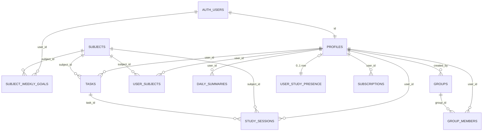

# Tymii — Documentation Technique

> Version 1.4 — Avril 2026  
> Stack : React Native / Expo SDK 54 + Supabase  
> Plateformes : iOS & Android (App Store + Google Play)  
> Auteur : Julie Maitre

---

## Table des matières

1. [Vue d'ensemble](#1-vue-densemble)
2. [Architecture Technique](#2-architecture-technique)
   - [2.4 Variables d'environnement](#24-variables-denvironnement)
   - [2.5 Cache, réseau et observabilité](#25-cache-réseau-et-observabilité)
3. [Base de Données & Sécurité](#3-base-de-données--sécurité)
   - [3.0 Schéma relationnel (tables et relations)](#30-schéma-relationnel-tables-et-relations)
4. [Système de Gamification](#4-système-de-gamification)
5. [Module Natif — Focus Mode](#5-module-natif--focus-mode)
6. [Onboarding & Profil](#6-onboarding--profil)
7. [Checklist Publication Stores](#7-checklist-publication-stores)
8. [Carte des Écrans](#8-carte-des-écrans)
9. [Fonctionnalités Détaillées](#9-fonctionnalités-détaillées)
10. [Design System & i18n](#10-design-system--i18n)
11. [Plans d'étude récurrents — roadmap](#11-plans-détude-récurrents--roadmap)

---

## 1. Vue d'ensemble

Tymii est une application mobile de suivi du temps d'étude, conçue sur le modèle de Strava appliqué aux études. Elle permet aux étudiants de chronométrer leurs sessions par matière, de se comparer au sein de groupes, et de progresser grâce à un système de gamification (XP, streaks, niveaux).

### Positionnement

L'application cible principalement les lycéens, étudiants en prépa et étudiants universitaires. Sa proposition de valeur repose sur trois piliers :

- **Suivi précis** — sessions chronométrées par matière avec objectifs hebdomadaires
- **Gamification** — XP, niveaux, streaks et classements pour maintenir la motivation
- **Dimension sociale** — groupes d'étude, leaderboard et dynamique collective

### Fonctionnalités principales

| Fonctionnalité | Description |
|---|---|
| ⏱️ Timer Focus | Chronométrage de sessions par matière et/ou tâche |
| ✅ Tâches | Gestion avec statuts planned / in-progress / done |
| 🎯 Objectifs | Objectifs hebdomadaires par matière et par jour |
| 📊 Dashboard | Stats, histogramme réel vs prévu, streak |
| 👥 Groupes | Groupes publics/privés, classement, admin |
| 🔴 Live groupe | Qui étudie maintenant (présence + Realtime) |
| 📅 Calendrier stats | Vue calendrier du temps étudié (depuis Stats) |
| ⭐ XP & Niveaux | Gamification basée sur les minutes étudiées |
| 🌙 Thème & i18n | Mode sombre/clair, Français et Anglais |
| 🔒 Mode Focus | Module natif Android/iOS (contrôles parentaux) |

---

## 2. Architecture Technique

### 2.1 Stack technologique

| Couche | Technologie | Version / Détail |
|---|---|---|
| Frontend | React Native + Expo | SDK 54, TypeScript strict |
| Routing | expo-router | Groupes (auth) / (tabs) |
| Backend | Supabase | Auth, DB, Storage, Realtime |
| Base de données | PostgreSQL | Via Supabase, RLS actif |
| Build | EAS Build + EAS Submit | Profils dev / preview / prod |
| Updates OTA | expo-updates | Channel production |
| i18n | i18next | FR / EN |
| Module natif | focus-module | Android Kotlin + plugin iOS |

### 2.2 Structure du projet (architecture des dossiers)

Racine utile pour l’app et le backend déclaratif (le dépôt local peut s’appeler autrement que le dossier illustré ; **Tymii** est le nom produit, `package.json` → `name: "tymii"`).

```
tymii/
├── app/                      # expo-router — écrans et navigation
│   ├── _layout.tsx           # Stack racine (auth / tabs / chargement)
│   ├── (auth)/               # Connexion, inscription, onboarding profil
│   │   ├── signin.tsx
│   │   ├── signup.tsx
│   │   ├── fill-profile.tsx
│   │   ├── forgot-password.tsx
│   │   ├── verify-email.tsx
│   │   └── reset-password-complete.tsx
│   ├── (tabs)/               # Zone connectée (barre d’onglets)
│   │   ├── index.tsx         # Focus (minuteur)
│   │   ├── tasks.tsx
│   │   ├── groups.tsx
│   │   ├── dashboard.tsx     # Stats
│   │   ├── profile.tsx
│   │   ├── leaderboard.tsx   # hors barre (href masqué), entrée depuis Groupes
│   │   ├── group-live.tsx    # présence « qui étudie », hors barre (depuis Groupes)
│   │   ├── calendar-stats.tsx # calendrier temps étudié, hors barre (depuis Stats)
│   │   └── color-palette.tsx # outil thème (hors barre)
│   ├── modal.tsx
│   ├── +not-found.tsx
│   └── ui.tsx
├── components/
│   ├── ui/                   # Button, Input, Modal, TaskCard, SubjectPicker, SubjectBar, …
│   ├── layout/               # Screen, Header, TabScreen
│   ├── planning/             # WeeklyGoalsPanel, …
│   ├── profile/              # AcademicPathModal, …
│   └── Themed.tsx
├── constants/                # subjectCatalog, categories, typography, Colors, …
├── hooks/                    # useTimer, useTasks, useDashboard, useGroups, useStudyPresenceSync, …
├── i18n/                     # i18next — locales fr.json / en.json
├── modules/focus-module/     # Module natif Focus (Expo module — Android Kotlin, iOS)
├── plugins/                  # withFocusMode.js (config Expo)
├── utils/
│   ├── supabase.ts           # Client Supabase (lit les variables EXPO_PUBLIC_*)
│   ├── authContext.tsx
│   ├── themeContext.tsx
│   ├── queries.ts
│   ├── queries/              # types partagés requêtes (ex. types.ts)
│   ├── time.ts
│   ├── color.ts
│   └── ensureDefaultSubjectsFromKeys.ts
├── assets/                   # Images, docs internes éventuels
├── landing/                  # Page marketing statique (ex. index.html)
├── documentation/          # TECH_STACK, guides build, audits SQL, …
├── supabase/migrations/      # Migrations appliquées via Supabase CLI (dépôt distant)
├── migrations/               # Scripts SQL historiques / sync (voir migrations/MIGRATION_GUIDE.md)
├── full_structure.sql        # Export / référence schéma public (voir §3.0)
├── app.json                  # Config Expo (ne pas modifier sans accord produit)
├── package.json
└── eas.json                  # Profils EAS (ne pas modifier sans accord produit)
```

Ordre des onglets visibles dans la barre : **Focus** → **Tâches** → **Groupes** → **Stats** (dashboard) → **Profil** (`app/(tabs)/_layout.tsx`).

Objectifs hebdomadaires (minutes par matière et jour) : écran **Focus** via `components/planning/WeeklyGoalsPanel.tsx`, persistance `subject_weekly_goals`.

### 2.3 Authentification — méthodes et flux navigation

**Backend :** [Supabase Auth](https://supabase.com/docs/guides/auth) (JWT côté client, session via `supabase.auth`).

| Méthode | Implémentation dans l’app |
|--------|---------------------------|
| **Email + mot de passe** | `signInWithPassword`, `signUp` (`utils/authContext.tsx`), confirmation email et reset mot de passe (`forgot-password`, `verify-email`, `reset-password-complete`). |
| **Google** | OAuth : `signInWithOAuth` avec `redirectTo` = URI scheme `tymii`, puis `exchangeCodeForSession` après retour navigateur in-app (`expo-web-browser`). |
| **Apple** | **iOS uniquement** : `expo-apple-authentication` + `signInWithIdToken({ provider: 'apple', token })` — pas le même flux que le OAuth web Google. |

Flux de navigation (états `AuthContext`) :

```
Non authentifié           →  groupe (auth)
Authentifié + onboarding  →  fill-profile
Authentifié + profil OK   →  groupe (tabs)
```

### 2.4 Variables d'environnement

Le client Supabase est initialisé dans `utils/supabase.ts` à partir des variables **publiques** Expo (préfixe `EXPO_PUBLIC_`, embarquées dans le bundle).

| Variable | Obligatoire | Rôle |
|----------|-------------|------|
| `EXPO_PUBLIC_SUPABASE_URL` | Oui | URL du projet Supabase (`https://<ref>.supabase.co`). |
| `EXPO_PUBLIC_SUPABASE_ANON_KEY` | Oui | Clé **anon** (sécurisée par RLS côté Postgres — ne jamais utiliser la service role dans l’app). |

**Sécurité — préfixe `EXPO_PUBLIC_` :** toute variable ainsi nommée est **incluse dans le bundle JavaScript** livré sur l’appareil (inspectable). Seules des valeurs **conçues pour être publiques** (URL projet, clé anon) y ont leur place. La **Service Role Key** et tout secret serveur ou clé API privée ne doivent **jamais** figurer dans le repo mobile ni sous `EXPO_PUBLIC_*`, y compris en debug — les réserver à Edge Functions, scripts CI ou au dashboard Supabase.

**Fichiers :** copier `.env.example` vers `.env` en local ; pour **EAS Build**, définir les mêmes clés dans les secrets / variables du tableau de bord EAS ou `eas secret:create`.

Aucune autre variable `EXPO_PUBLIC_*` n’est requise par le code applicatif actuel pour Supabase (recherche dans `utils/` et `app/`).

### 2.5 Cache, réseau et observabilité

État au moment de la rédaction (éviter d’inférer TanStack Query, Sentry ou une file offline si ce n’est pas dans le dépôt).

| Sujet | Réalité dans le projet |
|-------|-------------------------|
| **Cache données** | Pas de **TanStack Query (React Query)** ni **SWR**. Les hooks (`useDashboard`, `useGroups`, etc.) chargent via Supabase dans l’état React ; le **leaderboard** se rafraîchit à l’ouverture et au pull-to-refresh — il n’y a pas de `staleTime` centralisé à documenter. |
| **Hors ligne / minuteur** | Pas de stratégie *offline-first* : à l’arrêt du minuteur, l’enregistrement passe par `logSession` (`hooks/useTimer.ts`) et **requiert une connexion**. Sans réseau, la session peut échouer (`save_failed`) ; pas de file d’attente locale (AsyncStorage / WatermelonDB) pour rejouer plus tard. |
| **Crash reporting** | Pas d’intégration **Sentry**, **Bugsnag** ou équivalent dans l’app. En développement : `console` / Metro ; en production : investigation via repro, **logs Supabase** (Auth, API, erreurs SQL selon offre) et éventuellement ajout futur d’un service d’observabilité. |

---

## 3. Base de Données & Sécurité

### 3.0 Schéma relationnel (tables et relations)

**Sources dans le dépôt :** `full_structure.sql` (schéma `public` exporté — à régénérer après changements SQL), scripts sous **`migrations/`** (exécution manuelle dans le SQL Editor Supabase, voir `CLAUDE.md`), et le dossier `supabase/migrations/` si utilisé pour le dépôt distant. Les noms ci-dessous sont ceux des tables PostgreSQL.

**Cœur identité**

- `auth.users` (Supabase) — utilisateurs Auth.
- `profiles` — PK `id` **=** FK vers `auth.users(id)` (1:1). Profil app (XP, streak, onboarding, préférences).

**Matières et liaison utilisateur**

- `subjects` — matières globales (`owner_id` NULL) ou personnelles ; `bank_key` pour rattachement au catalogue applicatif. Modèle **plat** : plus de hiérarchie `parent_subject_id` (migration `migrations/20260416180000_drop_subjects_parent_subject_id.sql`). Détachement du catalogue global par utilisateur : `migrations/20260423100000_ypt_detach_global_subjects_per_user.sql`.
- `user_subjects` — (`user_id` → `profiles`, `subject_id` → `subjects`) : matières visibles / ordre / couleur perso.

**Temps d’étude et tâches**

- `study_sessions` — `user_id` → `profiles`, `subject_id` → `subjects`, `task_id` → `tasks` (nullable, ON DELETE SET NULL).
- `tasks` — `user_id` → `profiles`, `subject_id` → `subjects` (nullable possible selon données).
- `daily_summaries` — PK composite (`user_id`, `date`) ; `user_id` → `profiles` ; agrégats journaliers.
- `subject_weekly_goals` — `subject_id` → `subjects` ; **`user_id` → `auth.users(id)`** (pas `profiles`, à noter dans le dump courant).

**Groupes**

- `groups` — `created_by` → `profiles`.
- `group_members` — `group_id` → `groups`, `user_id` → `profiles`.

**Présence temps réel (vue live groupe)**

- `user_study_presence` — au plus **une ligne par utilisateur** (PK `user_id` → `profiles`, `ON DELETE CASCADE`) ; indicateur éphémère du minuteur (`is_studying`, `session_started_at`, `updated_at`). Consommée par l’écran **group-live** avec **Supabase Realtime** sur cette table. Migration `migrations/20260422150000_user_study_presence_group_peers.sql` (RLS, publication Realtime si disponible, fonction `rls_users_share_approved_group` et ajustements SELECT sur `profiles` / `group_members` pour les co-membres approuvés des groupes privés).

**Abonnement (prévu)**

- `subscriptions` — PK `user_id` → `profiles` (une ligne par utilisateur si utilisé).

**Vues / MV (hors tables métier)** : `session_overview`, `session_subject_totals` (vues) ; `weekly_leaderboard`, `monthly_leaderboard`, `yearly_leaderboard` (vues matérialisées — rafraîchissement serveur périodique).



### 3.1 Tables principales

| Table | RLS | Description |
|---|---|---|
| `profiles` | ✅ Actif | Profil utilisateur, niveau, XP, streak |
| `study_sessions` | ✅ Actif | Sessions chronométrées par matière |
| `tasks` | ✅ Actif | Tâches avec statut et soft delete |
| `subjects` | ✅ Actif | Matières (catalogue + personnalisées) |
| `user_subjects` | ✅ Actif | Association utilisateur ↔ matières |
| `groups` | ✅ Actif | Groupes d'étude (public/privé) |
| `group_members` | ✅ Actif | Membres avec rôle et statut d'approbation |
| `subject_weekly_goals` | ✅ Actif | Objectifs hebdomadaires par matière/jour |
| `daily_summaries` | ✅ Actif | Résumés journaliers (agrégation server-side) |
| `user_study_presence` | ✅ Actif | Présence minuteur pour la vue live groupe (ligne optionnelle par user) |
| `subscriptions` | ✅ Actif | Abonnements (lecture seule côté client) |

### 3.2 Audit RLS — Résultat (Avril 2026)

| Point vérifié | Statut | Détail |
|---|---|---|
| RLS activé sur toutes les tables | ✅ OK | 100% des tables protégées |
| WITH CHECK sur tous les INSERT | ✅ Corrigé | `auth.uid() = user_id` sur toutes les tables |
| Policies SELECT avec auth.uid() | ✅ OK | Isolation stricte par utilisateur |
| `groups` / `group_members` — pas de cycle RLS | ✅ Corrigé (17 avr. 2026) | Les politiques qui croisaient `EXISTS` sur l’une et l’autre table provoquaient l’erreur Postgres `42P17` (récursion infinie). **Correction :** fonctions `public.rls_current_user_is_approved_group_member`, `rls_current_user_is_approved_group_admin`, `rls_group_is_public_or_current_user_creator` (`SECURITY DEFINER`, `search_path = public`) appelées depuis les politiques — migration `migrations/20260417120000_fix_groups_rls_infinite_recursion.sql`. |
| groups SELECT — membres approuvés | ✅ OK | Via la fonction membre ci-dessus (même intention métier qu’avant) |
| subscriptions — blocage INSERT/UPDATE | ✅ OK | `WITH CHECK (false)` — server-side uniquement |
| profiles INSERT policy | ✅ OK | Trigger `on_auth_user_created` sur auth.users |
| daily_summaries INSERT/UPDATE | ✅ OK | Server-side uniquement, bypasse RLS |
| `profiles` SELECT — co-membres de groupe | ✅ OK (22 avr. 2026) | Policy étendue : lecture de profils des utilisateurs avec lesquels on partage un groupe **approuvé** (`rls_users_share_approved_group`) — migration `migrations/20260422150000_user_study_presence_group_peers.sql`. |
| `user_study_presence` | ✅ OK | INSERT/UPDATE/DELETE **soi** ; SELECT réservé aux pairs (même groupe approuvé) + sa propre ligne — même migration. |

### 3.3 Récapitulatif détaillé par opération

| Table | INSERT | SELECT | UPDATE | DELETE | Statut |
|---|---|---|---|---|---|
| `study_sessions` | ✅ | ✅ | ✅ | ✅ | 🟢 Parfait |
| `tasks` | ✅ | ✅ | ✅ | ✅ | 🟢 Parfait |
| `user_subjects` | ✅ | ✅ | ✅ | ✅ | 🟢 Parfait |
| `subject_weekly_goals` | ✅ | ✅ | ✅ | ✅ | 🟢 Parfait |
| `subjects` | ✅ | ✅ | ✅ | ✅ | 🟢 Parfait |
| `groups` | ✅ | ✅ | ✅ | ✅ | 🟢 Parfait |
| `group_members` | ✅ | ✅ | ✅ | ✅ | 🟢 Parfait |
| `subscriptions` | ✅ blocked | ✅ | ✅ blocked | — | 🟢 Parfait |
| `profiles` | ✅ trigger | ✅ | ✅ | — | 🟢 Parfait |
| `daily_summaries` | ✅ server | ✅ | — | — | 🟢 Parfait |
| `user_study_presence` | ✅ | ✅ | ✅ | ✅ | 🟢 Parfait |

> **Audit RLS** — Couverture des tables principales validée ; le schéma exporté `full_structure.sql` peut rester en retard sur les correctifs appliqués directement en production (regénérer l’export après migrations).

### 3.4 Colonnes et tables — référence produit

Synthèse alignée sur le schéma Supabase (noms anglais en base).

| Table | Rôle principal |
|---|---|
| `profiles` | `id` (PK, FK `auth.users`), `username` (contrainte longueur ≥ 3), `avatar_url`, `xp_total`, `level`, `current_streak`, `longest_streak`, `weekly_goal_minutes`, `language_preference`, `theme_preference`, `is_public`, `show_in_leaderboard`, champs onboarding (`onboarding_completed`, `academic_category`, etc.), `created_at`, `updated_at` |
| `subjects` | `id`, `name`, `slug` (catalogue / unicité côté global), `owner_id` (NULL = matière catalogue globale), `icon`, `color`, `is_active`, `deleted_at` (soft delete), `bank_key` (clé de rattachement banque applicative), `created_at`, `updated_at` |
| `user_subjects` | `user_id`, `subject_id`, `is_hidden`, `display_order`, `custom_color` (surcharge couleur utilisateur) |
| `study_sessions` | `id`, `user_id`, `subject_id`, `task_id`, `started_at`, `ended_at`, `notes`, `duration_seconds` (généré ou dérivé selon migration) |
| `tasks` | `id`, `user_id`, `title`, `subject_id`, `planned_minutes`, `logged_seconds`, `status` (`planned` \| `in-progress` \| `done`), `scheduled_for`, `created_at`, `updated_at`, `deleted_at` si soft delete |
| `groups` | `id`, `name`, `description`, `visibility` (`public` \| `private`), `invite_code`, `requires_admin_approval`, `join_password`, `has_password` (souvent colonne générée si `join_password` non null), `created_by`, `created_at` |
| `group_members` | `id`, `group_id`, `user_id`, `role` (`group_admin` \| `group_member`), `status` (`pending` \| `approved`), `created_at` |
| `daily_summaries` | PK (`user_id`, `date`) ; `user_id` → `profiles` ; `total_seconds`, `updated_at` |
| `subject_weekly_goals` | Objectifs par matière et par jour de semaine : `user_id`, `subject_id`, `day_of_week` (0 = dimanche … 6 = samedi), `minutes` |
| `user_study_presence` | PK `user_id` → `profiles` ; `is_studying`, `session_started_at`, `updated_at` (lignes périmées si `updated_at` ancien) |
| `subscriptions` | Prévu pour l’abonnement (Stripe / lecture côté client) — hors flux cœur si non activé |

### 3.5 Vues et vues matérialisées

| Objet | Rôle |
|---|---|
| `weekly_leaderboard` | Agrégation à partir des `study_sessions` (fenêtre ~7 jours) ; respect de `show_in_leaderboard` |
| `monthly_leaderboard`, `yearly_leaderboard` | Souvent basées sur `daily_summaries` (fenêtres 30 / 365 jours) |
| `session_overview` | Par utilisateur : nombre de sessions, temps total, mois en cours, moyenne par session |
| `session_subject_totals` | Vue : temps total des sessions par utilisateur et par matière (`subject_id`, `subject_name`, `total_seconds`, `direct_seconds`, `subtag_seconds`). Jointure sur les matières actives (`deleted_at` nul). |

Les classements matérialisés nécessitent un **REFRESH** périodique (job ou cron) selon la politique déployée sur le projet.

### 3.6 Fonctions RPC (exemples)

| Fonction | Usage |
|---|---|
| `delete_current_user` | Suppression de compte |
| `find_group_by_invite_code` | Recherche groupe par code |
| `request_join_group` | Demande d’adhésion |
| `increment_task_seconds` | Mise à jour du temps passé sur une tâche |
| `create_group_with_creator` | Création groupe + créateur admin en une transaction (`SECURITY DEFINER` — exécution cohérente côté serveur). L’app peut aussi créer un groupe par **`insert` REST sur `groups`** puis ligne `group_members` (`utils/queries.ts`) ; les politiques corrigées (§3.2) évitent la récursion RLS sur ces lectures/écritures. |
| `regenerate_invite_code` | Régénération du code (admin) |

### 3.7 Triggers et automatisations

| Élément | Comportement |
|---|---|
| `on_auth_user_created` / `handle_new_user` | Création de ligne `profiles` à l’inscription (`onboarding_completed = false`) |
| `update_profiles_timestamp` | Avant UPDATE sur `profiles` : met à jour `updated_at` via `set_updated_at()` |
| `handle_session_completed` / `on_session_completed` (après INSERT `study_sessions`) | MAJ `xp_total`, `level`, `daily_summaries`, streaks |
| `handle_task_completed_xp` / `on_task_completed_xp` (après UPDATE `tasks`) | +5 XP à la première transition vers `done`, recalcul du niveau |

### 3.8 Storage Supabase

- Bucket **`avatars`** : photos de profil, convention de chemin du type `{userId}-{timestamp}.{ext}`.

### 3.9 Énumérations et confidentialité

- **Enums** : `group_role`, `group_visibility`, `membership_status` (libellés exacts selon migration).
- **Confidentialité** : `is_public`, `show_in_leaderboard` sur `profiles` ; les vues classement filtrent les utilisateurs qui acceptent d’apparaître.

---

## 4. Système de Gamification

### 4.1 XP & Niveaux

| Élément | Règle |
|---|---|
| XP de base | 1 XP par minute étudiée (`duration_seconds / 60`) |
| Bonus tâche | +5 XP au premier passage au statut `done` (trigger `on_task_completed_xp` sur `tasks`) |
| Niveau | `niveau = 1 + floor(XP / 100)` |
| Streak | Jours consécutifs avec au moins une session |

Le calcul est effectué côté serveur via des fonctions SQL `SECURITY DEFINER`.

### 4.2 Groupes & Classement

- Groupes publics (rejoindre librement) et privés (code + approbation admin)
- Leaderboard par période : semaine, mois, année
- Classement basé sur le temps total d'étude agrégé (vues / MV côté base, requêtées par l’app)
- **Realtime** : dans `useGroups`, abonnement `postgres_changes` sur la table `group_members` (rafraîchissement de la liste des groupes lors des changements de membres). Sur **`user_study_presence`**, abonnement Realtime depuis **`group-live.tsx`** pour mettre à jour la liste des pairs « en étude » dans un groupe ; côté minuteur, **`useStudyPresenceSync`** (`hooks/useStudyPresenceSync.ts`) upsert l’état quand le timer tourne. L’écran **Classement** (`leaderboard.tsx`) charge les données via `fetchLeaderboardByPeriod` à l’ouverture et au **pull-to-refresh** — pas d’abonnement Realtime sur le classement lui-même (voir **§2.5** pour l’absence de couche cache type React Query).

---

## 5. Module Natif — Focus Mode

| Plateforme | Implémentation |
|---|---|
| Android | Module Kotlin natif (`modules/focus-module/`) |
| iOS | Plugin natif (Screen Time API / Family Controls) |
| Config publication | Exigence Focus désactivée pour la soumission store |
| Hook | `useStudyMode` — réactivable post-publication |

> ⚠️ **Family Controls** : entitlement `com.apple.developer.family-controls` soumis à approbation Apple. Demande déposée — délai estimé 5-10 jours ouvrés. Activation prévue en v1.1.

---

## 6. Onboarding & Profil

### 6.1 Flux d'onboarding

| Étape | Écran | Contenu |
|---|---|---|
| Étape 1 | Identité | Nom affiché (obligatoire) + photo de profil |
| Étape 2 | Parcours scolaire | Catégorie, niveau, spécialités (lycée) |
| Finalisation | Matières par défaut | Attachées depuis le catalogue selon le parcours |

Champs stockés en base : `onboarding_completed`, `academic_category`, `academic_year_key`, `specialty_keys`.

### 6.2 Catégories scolaires supportées

- Primaire, Collège, Lycée (avec spécialités Première/Terminale)
- Prépa (CPGE), Université, Autres

---

## 7. Checklist Publication Stores

### 7.1 App Store (Apple)

- [ ] Compte Apple Developer actif (99€/an)
- [ ] Bundle ID : `com.juliemaitre.tymii`
- [ ] Screenshots 6.7" + 6.1" obligatoires
- [ ] Description FR + EN (max 4000 caractères)
- [ ] Privacy Policy URL
- [ ] Approbation Family Controls (en cours)
- [ ] EAS Build iOS production réussi

### 7.2 Google Play Store

- [ ] Créer compte Google Play Developer (25€ one-time)
- [ ] Screenshots + Feature Graphic (1024×500px)
- [ ] Privacy Policy URL
- [ ] Keystore géré par EAS (auto-increment build)
- [ ] Déclaration des permissions (module Focus)
- [ ] EAS Build Android production + EAS Submit

### 7.3 État des builds EAS

| Plateforme | Statut | Détail |
|---|---|---|
| Android production | ✅ Réussi | AAB v6 — 17/02/2026 — prêt à soumettre |
| iOS production | ❌ En erreur | Bloqué par Family Controls entitlement |

### 7.4 Points techniques pré-publication

| Point | Statut | Action |
|---|---|---|
| RLS Supabase | ✅ OK | WITH CHECK sur les INSERT ; groupes sans cycle `groups` ↔ `group_members` (migration `20260417120000_…`) |
| Deep links OAuth | ⚠️ À tester | Callback Apple/Google en build production |
| expo-updates production | ✅ Configuré | Channel production actif |
| Module Focus permissions | ⚠️ En attente | Approbation Apple Family Controls |
| profiles INSERT (trigger) | ✅ Confirmé | Trigger `on_auth_user_created` validé |

### 7.5 Commandes EAS

```bash
# Vérifier l'état des builds
eas build:list

# Build Android production
eas build --platform android --profile production

# Build iOS (après approbation Family Controls)
eas build --platform ios --profile production --clear-provisioning-profile

# Soumettre au Play Store
eas submit --platform android --profile production

# Soumettre à l'App Store
eas submit --platform ios --profile production
```

---

## 8. Carte des Écrans

| Route | Écran | Description |
|---|---|---|
| `/(auth)/signin` | Connexion | Email + mot de passe |
| `/(auth)/signup` | Inscription | Création de compte |
| `/(auth)/forgot-password` | Mot de passe oublié | Email de reset |
| `/(auth)/verify-email` | Vérification | Email |
| `/(auth)/reset-password-complete` | Fin de reset | Nouveau mot de passe |
| `/(auth)/fill-profile` | Onboarding | Identité + parcours + matières |
| `/(tabs)/` (`index`) | Focus | Timer principal + panneau objectifs hebdo |
| `/(tabs)/tasks` | Tâches | Liste et gestion |
| `/(tabs)/dashboard` | Stats | Tableau de bord (semaine/mois/an) |
| `/(tabs)/groups` | Groupes | Création et adhésion ; entrée vers le classement (icône trophée) |
| `/(tabs)/leaderboard` | Classement | Route présente, masquée de la barre d’onglets |
| `/(tabs)/group-live` | Live groupe | Qui étudie maintenant (membres du groupe) ; masquée de la barre |
| `/(tabs)/calendar-stats` | Calendrier stats | Temps par jour / période ; masquée ; entrée depuis l’onglet Stats |
| `/(tabs)/profile` | Profil | XP, niveau, matières, réglages |
| `/(tabs)/color-palette` | Palette | Écran outil / thème, masqué de la barre d’onglets |

---

## 9. Fonctionnalités Détaillées

### 9.1 Authentification

Les parcours sont regroupés dans le groupe de routes `(auth)`. Tant que l'utilisateur est connecté sans avoir terminé l'onboarding, l'app redirige automatiquement vers `fill-profile`. Méthodes disponibles : **email/mot de passe**, **Google (OAuth)** et **Apple (iOS, jeton natif)** — détail en **§2.3**.

| Écran | Rôle |
|---|---|
| Connexion | Email et mot de passe |
| Inscription | Création de compte |
| Mot de passe oublié | Demande de réinitialisation par email |
| Vérification e-mail | Suite à l'inscription, avec option renvoi |
| Réinitialisation complète | Nouveau mot de passe après clic sur le lien mail |

### 9.2 Focus & Minuteur

L'onglet Focus est l'écran principal de l'application.

**Présentation UX** : grand minuteur (format type HH:MM:SS), sélecteur de matière (liste, badges de couleur, ajout / banque), sélecteur de tâche optionnel pour les tâches liées à une matière, boutons **démarrer** et **arrêter** (hook `useTimer`). Pendant une session, **`useStudyPresenceSync`** peut publier l’état « en étude » vers **`user_study_presence`** pour les vues live groupe (voir **§4.2**). Sur mobile, le **mode Focus** système peut limiter les apps distrayantes (iOS : choix des apps à bloquer ; Android : permissions) ; le temps peut être enregistré selon la politique produit (voir §5). En-tête : icône cloche (notifications / rappels) ; actions flottantes typiques : raccourci « + » matières, bouton d’arrêt visible pendant une session active.

#### Déroulement d'une session

1. Choisir une matière dans le sélecteur et optionnellement une tâche active
2. Démarrer le minuteur
3. **Pas de pause / reprise utilisateur** dans l’implémentation actuelle : le hook expose `start`, `stop` (persiste la session) et `reset` (remet le compteur sans enregistrer de session). Si le mode Focus est **requis** (`strictFocus` / build) et que le focus système est perdu, le flux peut bloquer ou interrompre le minuteur selon la logique du module natif et de l’écran Focus
4. Arrêter : la session est enregistrée dans Supabase (`study_sessions` via `logSession` / flux associé)

#### Données enregistrées (`study_sessions`)

| Champ | Description |
|---|---|
| `started_at` / `ended_at` | Bornes temporelles de la session |
| `duration_seconds` | Durée totale en secondes |
| `subject_id` | Matière associée |
| `task_id` | Tâche liée (optionnel) |

Si une tâche est liée, le temps est ajouté via la RPC `increment_task_seconds`.

#### Module Focus système

Le module natif `focus-module` s'appuie sur les contrôles parentaux iOS/Android. L'exigence de mode Focus avant démarrage est actuellement désactivée pour la publication store. Le hook `useStudyMode` reste présent et réactivable en v1.1 après approbation Apple Family Controls.

### 9.3 Tâches

L'onglet Tâches organise le travail à réaliser par matière, avec suivi du temps passé. L’interface distingue en général les tâches **actives** et **terminées** (onglets ou sections), avec temps affiché (minutes enregistrées / planifiées).

#### Cycle de statuts

```
Création → planned / in-progress → done
                                      ↓
                              réactivation → active
```

| Statut | Description |
|---|---|
| `planned` | Tâche créée, pas encore commencée |
| `in-progress` | En cours, visible dans le sélecteur Focus |
| `done` | Terminée (réactivable) |

#### Champs principaux

| Champ | Rôle |
|---|---|
| `title` | Intitulé de la tâche |
| `subject_id` | Matière associée |
| `planned_minutes` | Estimation de la durée |
| `status` | `planned` / `in-progress` / `done` |
| `scheduled_for` | Date prévue (optionnel) |
| `deleted_at` | Soft delete — filtré dans les requêtes SELECT |

### 9.4 Objectifs Hebdomadaires

Les objectifs ne sont pas un onglet séparé : ils sont édités depuis **Focus** (panneau de planification hebdomadaire).

| Mode | Description |
|---|---|
| Par matière | Minutes cibles par matière, réparties sur la semaine |
| Par jour | Minutes par jour (0 = dimanche … 6 = samedi, aligné sur `Date.getDay()`), typiquement via curseurs |

Les lignes sont persistées dans **`subject_weekly_goals`** (`user_id`, `subject_id`, `day_of_week`, `minutes`, contrainte d’unicité sur le triplet utilisateur / matière / jour). Elles alimentent l’histogramme **réel vs prévu** du dashboard (hook `useSubjectGoals` / agrégations dans `utils/queries.ts`).

### 9.5 Statistiques & Tableau de Bord

#### Filtres temporels

- Périodes : **Semaine**, **Mois**, **Année**
- Navigation : période précédente ou suivante (sans dépasser la période courante)

#### Blocs de contenu

| Bloc | Description |
|---|---|
| Objectif hebdo | Barre de progression temps réel vs objectif cumulé (vue semaine) |
| Métriques | Temps total, streak (jours consécutifs), nombre de sessions |
| Répartition | Barres de pourcentage du temps par matière |
| Progression quotidienne | Histogramme réel vs prévu, filtrable par matière |

Les données sont chargées via le hook `useDashboard` branché sur Supabase. Navigation vers **`/(tabs)/calendar-stats`** (calendrier du temps étudié) depuis l’écran Stats (`router.push("/calendar-stats")`).

### 9.6 Groupes, invitations et classement

- **Mes groupes** et **groupes publics** (recherche par code ou nom).
- **Création** : nom, description, visibilité public / privé, mot de passe optionnel, approbation admin optionnelle.
- **Adhésion** : code d’invitation, mot de passe si requis, file d’attente si approbation admin.
- **Badges** : public / privé, mot de passe, approbation requise.
- **Leaderboard** : périodes semaine / mois / année ; rang, pseudo, temps total ; mise en avant du top 3 et de l’utilisateur courant ; chargement initial + **pull-to-refresh** (pas de subscription Realtime sur cet écran).
- **Live groupe** : écran **`group-live`** (route `/(tabs)/group-live`), ouvert depuis la fiche groupe ; affiche les pairs dont la présence est à jour dans **`user_study_presence`** (Realtime).

### 9.7 Profil, matières et compte

- **Identité** : nom affiché éditable, avatar (sélecteur d’image → bucket `avatars`).
- **Statistiques personnelles** : temps du mois, streak, nombre de sessions, rang leaderboard, moyenne par session, ventilation par matière.
- **Matières** : liste des matières du profil, couleurs, ajout (recherche / création), rattachement catalogue, couleur personnalisée, suppression.
- **Réglages** : langue FR / EN, thème clair / sombre, mode Focus (statut, permissions, iOS sélection d’apps), déconnexion, suppression de compte.

---

## 10. Design System & i18n

### 10.1 Thème couleur (identité produit)

| Jeton | Valeur / usage |
|---|---|
| Primaire (teal) | `#4AC9CC` |
| Primaire foncé | `#1F8E92` |
| Secondaire (coral) | `#F28C8C` |
| Palette matières | Bleu, vert, jaune, orange, rose, violet (badges) |
| Modes | Clair et sombre (`themeContext`) |

### 10.2 Layout navigation

- Barre d’onglets : **Focus**, **Tâches**, **Groupes**, **Stats** (dashboard), **Profil** ; feedback haptique à l’appui ; icônes en bulles.
- En-tête partagé : titre, actions droite (cloche / déconnexion / trophée selon l’écran).

### 10.3 Composants UI récurrents

| Composant | Variantes / notes |
|---|---|
| `Button` | `primary`, `secondary`, `outline`, `ghost`, `destructive` ; tailles `xs`–`lg` ; forme pill ; `iconLeft` / `iconRight` ; état chargement |
| `Input` | Icônes gauche / droite, label, erreur |
| `Modal` | Titre, actions annuler / confirmer |
| `SubjectPicker` | Liste déroulante de matières, pastilles de couleur |
| `SubjectBar` | Barre compacte de matières (sélection / pastilles) |
| `Tabs` | Style pill ou underline |
| Cartes | `Card`, `ListCard`, `ListItem` (selon usage dans le projet) |

### 10.4 Typographie

- Police **Inter** (graisses 400–800).
- Variantes typographiques : `h1`, `h2`, `subtitle`, `body`, `bodyStrong`, `caption`, `micro` (`constants/typography`).
- Chiffres tabulaires pour le minuteur.

### 10.5 Internationalisation

- Langues : **fr**, **en** (`i18n/locales`).
- Clés couvrant auth, onboarding, minuteur, tâches, groupes, classement, dashboard, calendrier stats (`calendarStats.*`), profil, commun.

---

## 11. Plans d'étude récurrents — roadmap

> **État (avril 2026)** : spécification produit et guide d’implémentation ; **non déployée** dans l’application actuelle. Aucune table `study_plans` dans le dépôt à cette date — à introduire via une nouvelle migration sous `supabase/migrations/` le jour où la fonctionnalité est priorisée.

### 11.1 Distinction avec les tâches

- **Tâches** : éléments ponctuels avec `scheduled_for` (ex. « Réviser le DS de maths »).
- **Plans d’étude** : **règles récurrentes** sur la durée (ex. « 2 h de maths chaque lundi, sauf juin–juillet, jusqu’en septembre 2027 »).

### 11.2 Modèle de données cible

**Table `study_plans`** (conceptuel) :

| Colonne | Type | Description |
|---|---|---|
| `id` | uuid | PK |
| `user_id` | uuid | FK → `auth.users` |
| `subject_id` | uuid | FK → `subjects` |
| `minutes_per_week` | integer | Total minutes / semaine (ex. 120) |
| `days_of_week` | smallint[] | 0 = dim … 6 = sam (ex. `[1]` = lundis) |
| `start_date` | date | Début |
| `end_date` | date | Fin (nullable = sans fin) |
| `excluded_ranges` | jsonb | Ex. `[{"start":"2026-06-01","end":"2026-07-31"}]` |
| `is_active` | boolean | Pause sans supprimer |
| `created_at`, `updated_at` | timestamptz | Audit |

**RPC `study_plan_occurrences(user_id, from_date, to_date)`** : retourne les occurrences planifiées (`planned_date`, `subject_id`, `minutes`, `plan_id`).

### 11.3 Couche applicative prévue

- **Types & requêtes** (`utils/queries.ts`) : type `StudyPlan`, `fetchStudyPlans`, `createStudyPlan`, `updateStudyPlan`, `deleteStudyPlan`, `fetchStudyPlanOccurrences`.
- **Hook** `useStudyPlans` : chargement, CRUD, `refetch`, option `getOccurrences(from, to)`.

### 11.4 UI (options de placement)

1. Nouvel onglet « Plans » / « Planning ».
2. Section « Plans d’étude » au-dessus ou en dessous de la liste des tâches.
3. Écran dédié `(tabs)/plans` ou modal ouvert depuis Tâches ou Profil.

**Formulaire** : `SubjectPicker`, minutes / semaine, multi-sélection jours, date début / fin optionnelle, plages d’exclusion (liste ajout / suppression).

**Liste** : résumé par plan (matière, horaire, plage, exclusions), actions modifier / supprimer / pause (`is_active`).

### 11.5 Intégration tâches & dashboard

- **Vue semaine** : afficher les blocs issus de `study_plan_occurrences` (lecture seule ou bouton « Ajouter comme tâche »).
- **Génération** : action « Créer les tâches de la semaine à partir des plans » (occurrences → `tasks` avec titre type « Maths (planifié) » et `scheduled_for`).
- **Dashboard** : comparer objectifs de plan vs temps réel par matière.

### 11.6 i18n prévu

Clés du type `studyPlans.title`, `studyPlans.add`, `studyPlans.edit`, `studyPlans.delete`, libellés de formulaire (`minutesPerWeek`, `daysOfWeek`, `startDate`, `endDate`, `exclusions`), `studyPlans.perWeekOn`, `studyPlans.until`, `studyPlans.except` (FR + EN).

### 11.7 Ordre d’implémentation suggéré

1. Migration SQL (`study_plans` + RLS + RPC occurrences).
2. Requêtes + hook `useStudyPlans`.
3. Écran liste minimal (CRUD).
4. Formulaire complet (jours, exclusions, dates).
5. Lien avec les tâches (vue semaine ou génération).
6. i18n et finitions.

### 11.8 Exemple métier

« 2 h de maths par semaine, chaque lundi, sauf juin–juillet, jusqu’à fin sept 2027 » :

- `minutes_per_week` = 120, `days_of_week` = `[1]`, `end_date` = `2027-09-30`, `excluded_ranges` = une entrée par été si les exclusions sont stockées année par année (ou évolution ultérieure du schéma pour « exclure juin–juillet chaque année »).

---

*Tymii — Documentation Technique v1.4 — Avril 2026*
